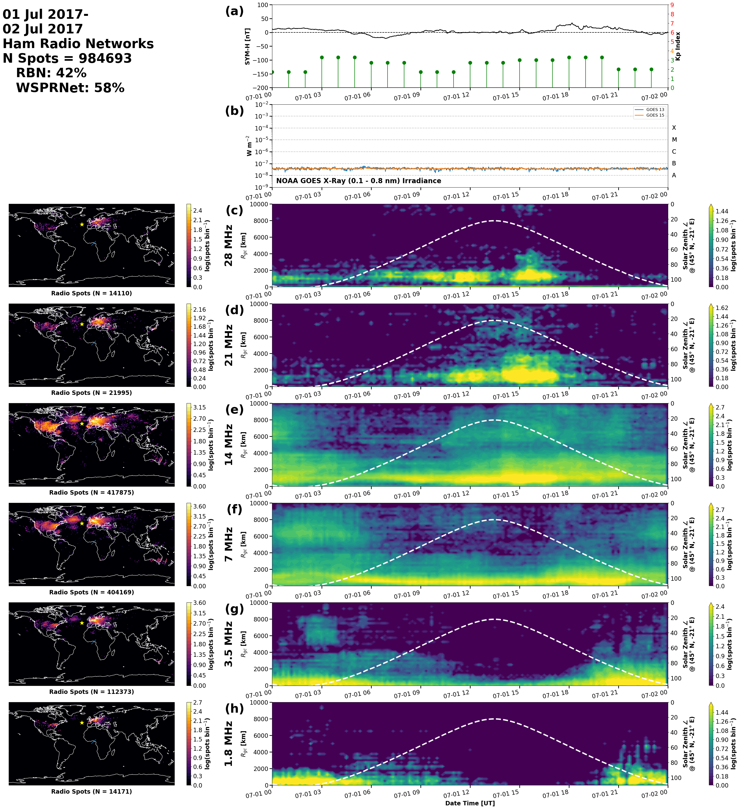

# HamSCI Amateur Radio Communications (HARC) Database Plotting Toolkit

## Requirements
* Ubuntu 18.04 LTS
* Anaconda Python 3.7

## Install Instructions
```
conda install -c conda-forge cartopy
git clone https://github.com/HamSCI/harc_plot.git
cd harc_plot
pip install -e .
```

## Test Installation
From the harc_plot directory:
```
cd scripts/basic_histogram
./histograms.py
```
The following plots will be generated:
```
output/galleries/histograms/World/ut_hrs/20170701.0000UT-20170702.0000UT.data.nc.ut_hrs.spot_density.png
output/galleries/histograms/World/slt_mid/20170701.0000UT-20170702.0000UT.data.nc.slt_mid.spot_density.png
output/galleries/histograms/World/ut_hrs/dailies/20170701.0000UT-20170702.0000UT.data.nc.ut_hrs.spot_density.png
output/galleries/histograms/World/slt_mid/dailies/20170701.0000UT-20170702.0000UT.data.nc.slt_mid.spot_density.png
```

