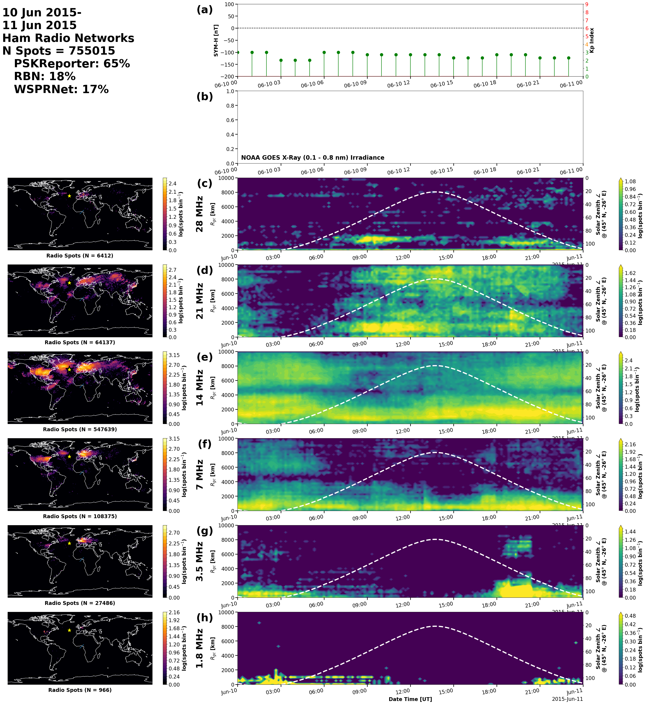

# HamSCI Amateur Radio Communications (HARC) Database Plotting Toolkit

Tools for loading and plotting HF amateur radio propagation spot data — from
RBN, WSPRNet, and PSKReporter — as distributed via the MIT Haystack CEDAR
[Madrigal database](http://cedar.openmadrigal.org/).

## Requirements

* Linux or macOS (tested on Ubuntu 22.04+). Windows is not supported directly;
  WSL2 works.
* Python 3.10 or newer.
* Conda recommended (miniconda or Anaconda) for managing the scientific Python
  stack.

Python dependencies are listed in `requirements.txt`. The main ones:
`numpy`, `pandas`, `xarray`, `netCDF4`, `tables` (pytables), `h5py`,
`matplotlib`, `cartopy`, `madrigalWeb`.

## Install

```bash
# Create and activate a conda environment
conda create -n harc_plot -c conda-forge python=3.11 cartopy pytables netCDF4 xarray pandas matplotlib tqdm
conda activate harc_plot

# Clone and install
git clone https://github.com/HamSCI/harc_plot.git
cd harc_plot
pip install -e .
```

`cartopy` is installed via conda because its binary dependencies (PROJ, GEOS)
are awkward to get from pip.

## Data input

The toolkit reads spot data in two formats:

1. **Madrigal HDF5 (preferred)** — files named `rsdYYYY-MM-DD.01.hdf5`, placed
   in `data/madrigal/`. Downloadable from the Madrigal database via
   `madrigalWeb`. A sample (`data/madrigal/rsd2015-06-10.01.hdf5`, ~39 MB,
   covering all three networks) ships with the repository for testing.
2. **Legacy CSV** — files named `YYYY-MM-DD.csv.bz2` placed in `data/spot_csvs/`
   (pre-Madrigal HamSCI pipeline).

`harc_plot.gen_lib.load_spots_csv()` auto-detects which format is present.

### A note about Madrigal timestamps

A subset of Madrigal ham-radio files (empirically: most of 2023 and 2024,
other years clean) have their `ut1_unix`/`ut2_unix` columns shifted by a
local-timezone offset. The HDF5 loader (`load_madrigal_hdf5()`) detects this
per file by comparing `ut1_unix` against the authoritative `y/m/d/h/m/s` byte
columns and corrects or falls back as needed. You will see a `RuntimeWarning`
on any affected file.

## Test installation

From the `harc_plot` directory:

```bash
cd scripts/basic_histogram
./histograms.py
```

This loads the bundled sample (`data/madrigal/rsd2015-06-10.01.hdf5`), bins it
into 2D histograms, and produces four plots:

```
output/galleries/histograms/World/ut_hrs/20150610.0000UT-20150611.0000UT.data.nc.ut_hrs.spot_density.png
output/galleries/histograms/World/slt_mid/20150610.0000UT-20150611.0000UT.data.nc.slt_mid.spot_density.png
output/galleries/histograms/World/ut_hrs/dailies/20150610.0000UT-20150611.0000UT.data.nc.ut_hrs.spot_density.png
output/galleries/histograms/World/slt_mid/dailies/20150610.0000UT-20150611.0000UT.data.nc.slt_mid.spot_density.png
```



## Data sources and acknowledgements

### Solar F10.7 cm radio flux

Solar F10.7 cm radio flux values bundled in `data/omni/` (and re-downloaded by
`data/omni/update_omni_data.py`) are obtained from the NASA OMNIWeb service
(<https://omniweb.gsfc.nasa.gov>) as part of the OMNI2 hourly compiled dataset,
which ingests F10.7 observations made at the Dominion Radio Astrophysical
Observatory (DRAO), Penticton, British Columbia, Canada, by Natural Resources
Canada.

NASA/SPDF assigns a separate DOI to each OMNI product; the hourly product used here is
`doi:10.48322/1shr-ht18`. The citation format and suggested acknowledgement wording below
follow <https://omniweb.gsfc.nasa.gov/html/citing.html>.

**Suggested acknowledgement for publications using this toolkit's F10.7 data:**

> Solar F10.7 cm radio flux data were obtained from the NASA OMNIWeb service
> (https://omniweb.gsfc.nasa.gov) as part of the OMNI2 hourly compiled dataset
> (Papitashvili & King, 2020, doi:10.48322/1shr-ht18), which ingests F10.7 observations made at the
> Dominion Radio Astrophysical Observatory, Penticton, British Columbia,
> Canada, by Natural Resources Canada. We acknowledge use of NASA/GSFC's Space
> Physics Data Facility's OMNIWeb service and OMNI data.

Note that F10.7 is determined **once per day**, so it cannot resolve solar
flares. Use GOES X-ray irradiance for flare timing (see below).

### GOES X-ray irradiance

`harc_plot.goes.read_goes_ncei()` retrieves 1-minute GOES XRS data from the NOAA
National Centers for Environmental Information (NCEI) over HTTPS, caching files in
`data/goes/`. Two archives are used and normalized to a common set of column names
(`A_AVG` for 0.05–0.4 nm, `B_AVG` for 0.1–0.8 nm):

* GOES 8–15 — GOES Space Environment Monitor archive, one netCDF per month
* GOES 16–19 — GOES-R series L2 `xrsf-l2-avg1m` product, one netCDF per day

The older `read_goes()` targets `ftp://satdat.ngdc.noaa.gov`, which NOAA retired
along with anonymous FTP; it now always fails and returns `None`. Prefer
`read_goes_ncei()`.

**Flare magnitudes are not comparable across satellite generations.** The pre-R
and GOES-R XRS instruments report on different flux scales — for the 2017-09-06
flare, GOES-15 gives X9.3 (the accepted classification), GOES-13 X10.4, and
GOES-16 X5.2. `goes_xrs_candidates()` therefore prefers the *primary operational*
satellite for each epoch, which reproduces the standard classifications.

**Suggested acknowledgement for publications using this toolkit's GOES data:**

> GOES X-ray irradiance data were obtained from the NOAA National Centers for
> Environmental Information (https://www.ncei.noaa.gov), from the GOES Space
> Environment Monitor archive (GOES 8–15) and the GOES-R series Level 2 X-Ray
> Sensor 1-minute average product (GOES 16–19).
